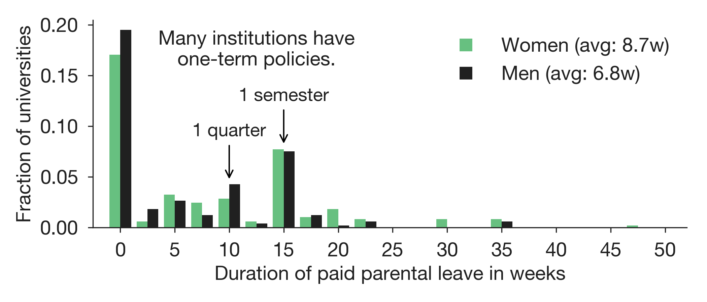
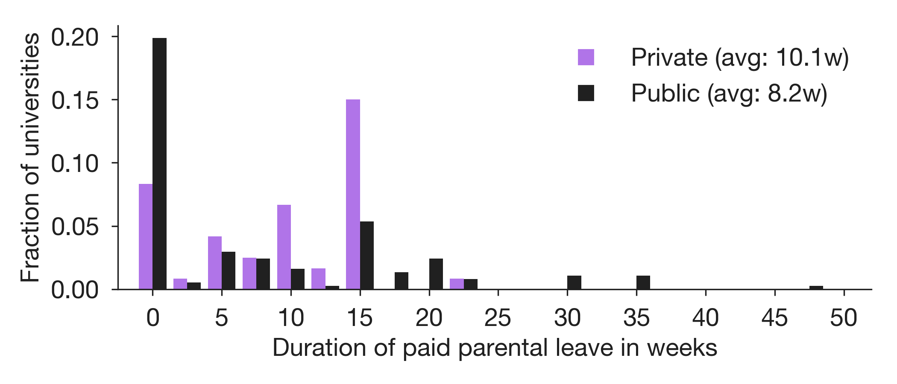
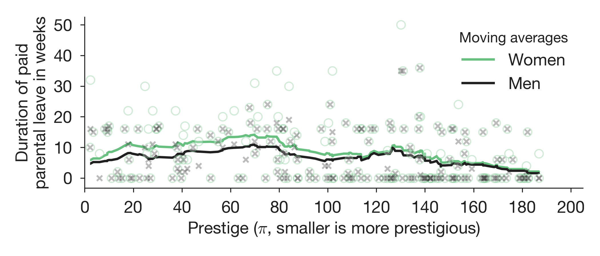

# Motivation

Inspired in part by a study of university parental leave policies by [Antecol et al.](https://docs.google.com/viewer?a=v&pid=sites&srcid=ZGVmYXVsdGRvbWFpbnxzdGVhcm5zamV8Z3g6NDE0NTM4MTBhYjBmYjhmYw) ([New York Times](https://www.nytimes.com/2016/06/26/business/tenure-extension-policies-that-put-women-at-a-disadvantage.html), [Inside HigherEd](https://www.insidehighered.com/news/2016/06/27/stopping-tenure-clock-may-help-male-professors-more-female-study-finds)), we recently collected the paid1 parental leave policies for tenure-track faculty2 at 205 research universities in the US and Canada. The purpose of this post is to share the data we collected, highlight the complexity of many such policies, and share some preliminary analyses.

# Methods

We collected parental leave policies of the 205 universities on the [Computing Research Association's](https://cra.org/about/) [Forsythe list](http://archive.cra.org/reports/forsythe.html) of PhD-granting institutions in the US and Canada, which reflects our specific interest in computing departments.

For each university, we Googled "[university name] faculty parental leave policy" or "[university name] faculty handbook" and recorded the institution's policy for female and male faculty separately, noting the duration of paid leave and form of relief granted, if stated (e.g. relief from just teaching, all duties, etc.). Several universities offer disability leave that may apply to some new parents.3 Here, we focused our efforts on recording policies specifically for parental leave. This process took about 5 minutes per university and recovered policies for 197 of the 205 target institutions (96%). The eight missing policies correspond to institutions whose faculty handbooks are either not available online or require an employee login. 

# Parental leave data

We've compiled the resulting dataset into a [spreadsheet](https://github.com/aaronclauset/parental-leave/blob/master/parental_leave_policies.tsv), included in this GitHub project. 

* If you spot an error or know the policy at an institution that isn't listed, please let us know using this [feedback form](https://goo.gl/forms/uZAVXaqRGpF3AjNS2). 
* If you can instead confirm that we correctly recorded the policy at your institution, please let us know [here](https://goo.gl/forms/O6gHXZVho2QZmnL13). 

Your feedback will help ensure that this dataset is as accurate as possible.

One immediate takeaway from our data collection effort is that university parental leave policies, as written, can be difficult to understand. For example, several policies we found state that if both parents are tenure-track faculty, they must share the parental leave benefit (e.g. [Toyota Technical Institute](http://www.ttic.edu/dl/faculty_handbook.pdf)). Other policies describe a short amount of time off at full-pay with relief from all duties, followed by a longer time off with relief only from some duties (e.g. Princeton's [leave](https://dof.princeton.edu/working-princeton/benefits/paid-leave-childbearing-for-faculty) and [workload relief](https://dof.princeton.edu/working-princeton/benefits/workload-relief-new-parents-for-faculty) policies). For consistency across universities, we recorded both types of policies as the longer amount of relief only. Confusingly, many parental leave policies are written in terms of “primary caregiver” benefits (e.g. [Michigan Technological University](https://www.mtu.edu/hr/current/benefits/docs/parental-leave.pdf)) without defining whether both parents can have that role or only one, as well as fractional amounts of salaries to be received (e.g. [University of Utah](https://regulations.utah.edu/academics/6-315.php)). Other policies are simple in structure and simple to understand, e.g., both parents can take 1 semester of paid leave with full relief of duties (e.g., [University of Colorado Boulder](https://www.cu.edu/ope/aps/5019)).

# Data summary

* About 60% of institutions have some form of paid parental leave for new mothers or fathers.
* For universities with paid leave policies, the average duration is 14.2 weeks for women and 11.6 weeks for men.
* Among universities that offer paid leave, 68.3% have gender-neutral policies (same leave for men and women).
* Private institutions have slightly longer leaves (by about 2 weeks).
* The relationship between an institution's prestige and its leave policies is complex and will require careful analysis.

<a href="#analysis">Read on below the visualization for more details.</a>

# Visualization

Explore the data. The university ranking option sorts by the inferred prestige of a university according to its Computer Science department (details [here](http://advances.sciencemag.org/content/1/1/e1400005)). Regions are U.S. Census regions plus Canada. All data points represent university-provided paid parental leaves only. Hover over a data point to see more details on the policy, including its primary source.

	<h4 class="title">Sort by: </h4>
	<button type="button" onclick="rearrange('sorted_by_name')">University Name</button>
	<button type="button" onclick="rearrange('sorted_by_prestige')">University Rank (CS)</button>
	<button type="button" onclick="rearrange('sorted_by_women')">Women's Leave</button>
	<button type="button" onclick="rearrange('sorted_by_men')">Men's Leave</button>

	<form autocomplete="off">
		<h4 class="title">Color by:</h4>
		<label>
		    <input type="radio" name="highlight" value="none" checked="checked"/>None
		</label>
		<label>
		    <input type="radio" name="highlight" value="pubpriv"/>Private/Public Status
		</label>
		<label>
		    <input type="radio" name="highlight" value="loc"/>Region
		</label>
	</form>

<h3></h3>

<!-- Begin D3 Javascript -->

# Preliminary analyses

Parental leave policies are highly variable across universities. Here are a few quick analyses to illustrate some of the patterns.

	Women receive paid parental leave at 120 of 197 institutions, and men at 114 of 197. Women receive longer parental leave than men (38 universities, or 19%). 77 institutions (39%) provide no paid parental leave. 82 institutions (42%) provide some non-zero amount of gender-neutral leave. Averaging over all data, women receive 8.7 weeks, while men receive 6.8 weeks. Only six universities offer paid leave to women but not men, and no universities offer leave to men without offering at least as much leave to women.

Private institutions provide slightly longer paid parental leaves on average, driven partly by public institutions being twice as likely to offer no paid parental leave at all. If a private institution offers leave, it is typically about one term of leave. Canadian universities also offer significantly more leave than US institutions (see interactive visualization), which reflects the Canadian government's mandate to provide paid leave for new parents (see footnote 1).

Using our Computer Science prestige ranking for universities (estimation described [here](http://advances.sciencemag.org/content/1/1/e1400005)), we find that parental leave and prestige exhibit a weak but complicated relationship. Overall, there is a slight positive correlation–more paid leave at more prestigious universities–but the effect size is modest, and the trend appears to reverse for the top 80 or so institutions. These observations suggest that the relationship between parental leave and prestige is complex and will require a level of care and analysis that goes beyond the scope of this blog post. We want to emphasize that these correlations should not be interpreted yet as causal of anything. Understanding the impacts of parental leave and other institutional policies on scientific careers, though, represents an interesting and important topic for future research, and we believe this dataset should help facilitate progress in that direction.

# Conclusions and future directions

This dataset is a building block that can be refined, extended, and incorporated into research on the science of science, and the information can help inform individuals comparing offers from different universities. Parental leave is just one of the many forms of support that institutions can provide to their employees, and achieving a greater understanding of how these and similar policies affect individuals would serve to enhance career experiences both within science and beyond.

Inferring such causal effects from our dataset will require it to be extended in one of several possible ways. First, it would be useful to know when policies were adopted and potentially how they changed over time. Knowing the history of these policies would make it possible to monitor changes in, for example, an institution's retention or recruitment of faculty before and after the adoption of the policy in order to assess its impact, as Antecol et al. did.

Our analysis above suggests a complicated relationship between the prestige of an institution and the duration of its parental leave policy. Part of that complication might arise from the nature of our measurement of prestige, which is derived from faculty placement power in the field of computer science. A university-level measure of prestige, rather than a field-specific measure, may provide more useful insights. For instance, how does the size of an institution's endowment translate into benefits for individual faculty? 

We hope that this blog post is thought provoking for faculty across institutions, and in particular, useful to new faculty navigating their institution’s parental leave policies. Feel free to explore this data set further and contact us with any questions or concerns (facultystudy@colorado.edu). 

# About us

Our research group studies the structure and dynamics of the academic workforce. In the past, we’ve investigated patterns in [faculty hiring outcomes](http://advances.sciencemag.org/content/1/1/e1400005), [researcher productivity](http://www.pnas.org/content/114/44/E9216), [gender's effects on scientific careers](https://arxiv.org/abs/1602.00795), and [faculty retention and promotion](https://arxiv.org/abs/1804.02760). We're located at the University of Colorado at Boulder and the Santa Fe Institute.

* [Aaron Clauset](http://tuvalu.santafe.edu/~aaronc/)
* [Mirta Galesic](https://www.santafe.edu/people/profile/mirta-galesic)
* [Dan Larremore](http://danlarremore.com/)
* [Allie Morgan](https://allisonmorgan.github.io/)
* [Sam Way](http://samfway.com/)

# Footnotes

1. Unpaid parental leave is federally mandated of all US ([FMLA](https://en.wikipedia.org/wiki/Family_and_Medical_Leave_Act_of_1993)) institutions. The Canadian government mandates unpaid leave of employers and offers partial financial support during leave, even if employer doesn’t ([EI](https://www.canada.ca/en/services/benefits/ei/ei-maternity-parental.html)).
2. By this we mean, assistant, associate, or full professors. See [“Academic tenure in North America”](https://en.wikipedia.org/wiki/Academic_tenure_in_North_America).
3. A few institutions lack policies for parental leave and instead refer faculty to apply for medical or disability leave. We coded these institutions as not guaranteeing paid parental leave to faculty, given the absence of a specific policy. Maternity leave, on the other hand, was coded as parental leave.
